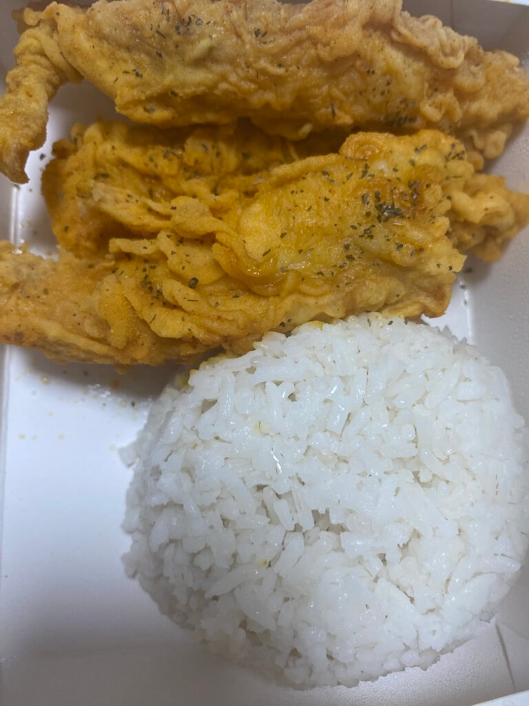
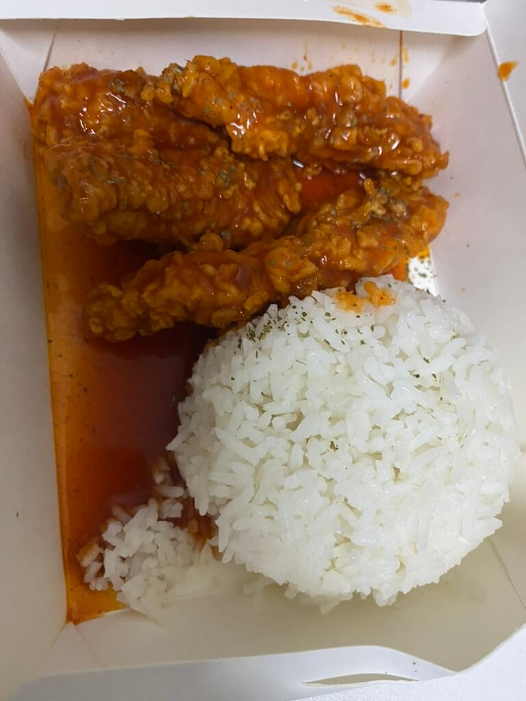
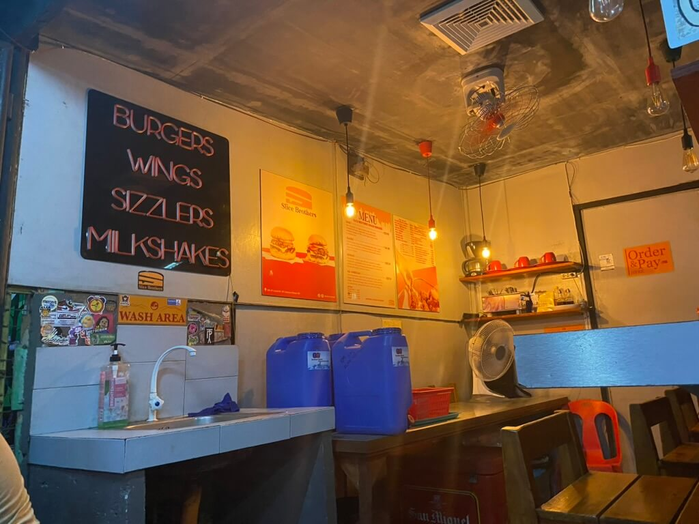

# At first glance, "oh, this is a burger place."

Wrong. Slice Brothers is a smoothie, burger place, and sisig place. But let me tell you, their chicken tenders are where it's at!

All you need to hear: crispy chicken, drenched in generous sauce, and a heap of rice. And for only PHP 109, it's totally worth it.

Let's talk about the chicken tenders. The portions are generous, and even after a 10-minute walk back to my place (with an additional PHP 5 takeout fee, by the way), the chicken stays crispy. That's a win in my book!

The rice is decent. As someone who loves sticky Japanese rice, it's not quite at that level, but it's filling and gets the job done.

I still remember my first time trying it. It was a rainy Wednesday, right before my Bio 11 exam. Safe to say, discovering **Slice Brothers Chicken Tenders** was one of the best things that happened that day.

And so, I went back the next week, and the week after that. It became a ritual – saving up some cash for a weekly fix of Slice Brothers Chicken Tenders.

Shoutout to Slice Brothers for being a consistent source of comfort food!

Sincerely,
scical.
